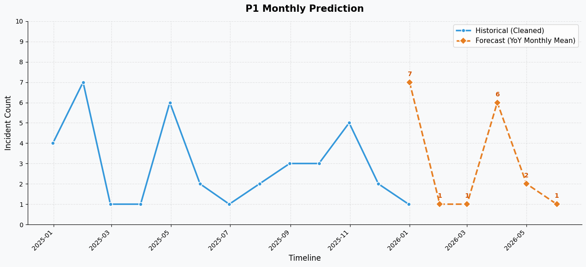
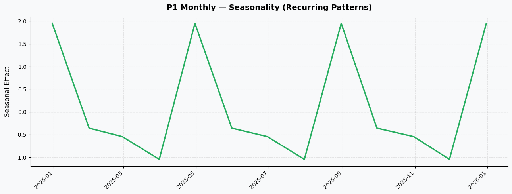
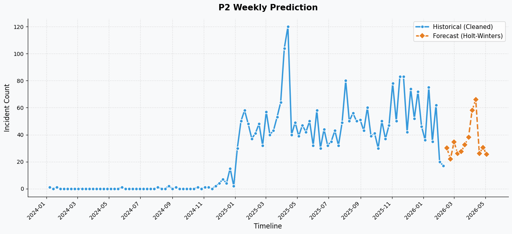

<div align="center">

# OIT Incident Intelligence
**Year-over-Year P1 & P2 Service Incident Analysis**

[](https://streamlit.io/)
[](https://python.org)
[](https://pandas.pydata.org/)
[](https://plotly.com/)

*An advanced Data Science & Analytics dashboard extracting actionable business insights and predicting workload demands from campus-wide service incidents.*

</div>

---

## Project Overview

The **OIT Incident Intelligence** platform is an interactive, analytical dashboard tailored for University IT Operations. By scraping and processing historical data from thousands of **ServiceNow IT Service Management (ITSM) tickets**, this project translates raw incident logs into data-driven, strategic business decisions. The dashboard evaluates **P1 (Critical)** and **P2 (High Priority)** service incidents, performing time-series forecasting, geographical hotspot tracking, and natural language categorization to optimize operational efficiency and resource allocation.

---

## Actionable Business Insights from ServiceNow Data

Our primary objective was to extract tangible business value from standard IT ticket logs. Here are the core insights delivered to OIT management:

### 1. Signal-to-Noise Reduction (Automated vs. Human-Reported)
We discovered that a significant volume of "Critical" P1 incidents were actually automated noise generated by system triggers like Azure Logic Apps, Zabbix, or PagerDuty integrations. 
By employing text-mining techniques on the ticket `short_description` fields, we successfully segregated true, human-reported outages from routine automated pings.
**Business Impact**: This prevented the Help Desk team from chasing non-actionable automated alerts, allowing OIT to reallocate engineering hours directly toward resolving actual campus-wide outages.

### 2. Service Impact & The Pareto Principle (80/20 Rule)
Our analysis mapped incident frequencies against specific IT services. The data confirmed the Pareto principle—approximately **20% of the core IT services or systems were responsible for 80% of the high-priority workload**.
**Business Impact**: This finding allows OIT management to strategically focus their preventative maintenance budget and manpower on this specific subset of problematic services, effectively reducing future IT incident volume at its root cause.

### 3. Geographical Hotspots & Issue Categorization
Instead of treating all campus incidents as an indistinguishable mass, we mined the ServiceNow ticket logs using natural language mapping to classify problems into broader categories like "Network/Wi-Fi", "Cloud/Server", and "Security/Account". Furthermore, we cross-referenced these tickets geographically to the top 10 physical campus buildings.
**Business Impact**: This highlighted structural infrastructure bottlenecks. For instance, OIT could easily visualize which specific academic buildings suffered the highest physical network degradation versus where the highest frequency of cloud login failures originated.

---

## Predictive Modeling & Trend Analysis

Beyond historical analysis, we implemented predictive modeling utilizing statistical methods like **Holt-Winters Exponential Smoothing** and **Seasonal Decomposition** to anticipate future workload demands.

### P1 (Critical) Incident Prediction
By filtering out the automated system anomalies and focusing solely on human-reported operations, we established a clean baseline for predicting future operational spikes.


### Incident Data Decomposition & Seasonality
Understanding our data composition means evaluating **Trend** (the overall increase or decrease of ticket frequency), **Seasonality** (recurring, cyclical demands dependent on academic semesters), and **Residuals** (unpredictable statistical outliers).


### P2 (High Priority) Volume Forecasting
Using Holt-Winters algorithms, we smoothed out irregular peaks in the P2 volume data. This allows OIT to predict the P2 trajectory seamlessly over dynamic semester operations and varying network load.


---

## Tech Stack & Methods
* **Dashboard Engine**: `Streamlit` with custom CSS mapping and Plotly dynamic visual integration.
* **Data Processing Pipeline**: `Pandas` and `Numpy` for IQR-based outlier correction, data cleansing, text scraping, and period re-indexing.
* **Predictive Modeling**: `Statsmodels` (Holt-Winters Exponential Smoothing and Seasonal Decomposition).
* **Data Visualization**: `Matplotlib` for static diagnostic charts and `Plotly` for interactive web dashboards.

---

## Running Locally

Want to explore the dashboard locally? Run the Streamlit application directly:

```bash
# 1. Install dependencies
pip install -r requirements.txt

# 2. Launch the Streamlit dashboard
streamlit run app.py
```

<div align="center">
<br/>
<sub>Built by <a href="https://github.com/silverfrost702" target="_blank">silverfrost702</a></sub>
</div>
